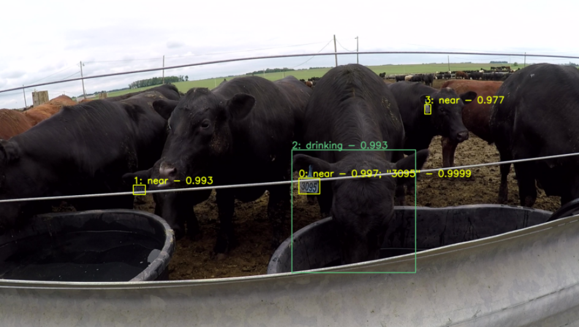

# Reading Cattle Ear Tags and Drinking Behaviour with Computer Vision
This project uses a two-step computer vision pathway to detect and read cattle ear tags:
- **Step 1**: use a custom **FasterRCNN** model to locate cattle ear tags and drinking cattle.
- **Step 2**: use a fine-tuned **TRBA** (TPS-ResNet-BiLSTM-Attn) model to read the selected ear tags (either of only drinking or all cattle). [1]


### Current Possibilities
| Input type | Possible output type | Place to look for example code usage |
| --- | --- | --- |
| Singular image | Dictionary, dataframe, csv, plt figure, png/jpg | *readTagsDemo.ipynb* |
| Directory of images | Dictionary, dataframe, csv, plt figures | *readTagsDemo.ipynb* |
| Video | Dictionary, raw dataframe, raw csv, cleaned dataframe, cleaned csv, opencv frame video | *readTagsDemo.ipynb*, *app_video.py* |
| Webcam | Raw dataframe, raw csv, opencv frame video | *app_webcam.py* |


***
## Getting Started
### Requirements:
1. [Python](https://www.python.org/downloads/): we used Python Version 3.10.4
2. Some kind of package manager such as anaconda or miniconda (instructions for installing miniconda are below)
3. Python modules including: torch, torchvision, pandas, matplotlib, nltk, jupyter, lmdb, natsort, and open cv (instructions for installing these packages on miniconda are below)
4. Custom model pth files. Please email me for these (msmink01 AT gmail DOT com).
5. Input files: images, videos, and/or a webcam. Examples of images, directories of images, and videos can be found in the *sample_inputs* directory

<br />**Installing miniconda**: \[2]
- Go to the [Miniconda Downloads](https://docs.conda.io/en/latest/miniconda.html#windows-installers) page. Download the appropriate (32- or 64-Bit) Python 3.X version of Miniconda.
- Double click on the .exe file and click Install.
- Read and agree to the licensing terms.
- Select if you want to install for ‘Just Me’ or ‘All Users’. If you are installing for ‘All Users’, you must have Administrator privileges.
- You will be prompted to select the installation location. By default, Anaconda should try to install in your home directory. We recommend accepting this default. Click Install.
- You will be asked if you want to add Anaconda to your PATH environment variable. Do not add Anaconda to the PATH because it can interfere with other software.
- You will be asked if you want Anaconda to be your default version of Python. We recommend ‘Yes’. There are some rare instances where you might not make Anaconda the default version, but they are beyond the scope of this article.
- Click the Install button.<p>

**Installing packages on miniconda**:
- Open the miniconda terminal. 
- Create a miniconda environment: 
``conda create --name myenv``
- Switch into the environment: ``conda activate myenv``
- Install the packages:
  - ``pip install pandas matplotlib nltk lmdb``
  - ``conda install torch==1.11.0 torchvision==0.12.0 torchaudio==0.11.0 cudatoolkit==11.3.1 -c pytorch``
  - ``conda install jupyter``
  - ``conda install natsort opencv``
- Check whether the installation was successful: run ``python`` in the terminal to start interactive python mode. Then: ``import torch, torchvision, lmdb, natsort, cv2, pandas, numpy, matplotlib, nltk``. If the installation was successful no error messages should appear. Type ``exit()`` to exit interactive mode.
  
<br />**After these requirements are met and every package can be imported in a jupyter notebook, proceed to the Usage section.**<br />
***
## Using the code base
### Please see *readTagsDemo.ipynb* to see examples of how to use the functions in *readTags.py* to read tags from singular images, directories of images, and videos.
### Using *app_video.py*
To see a frame by frame reading of a video:<br />
  ```
  python app_video.py --input path/to/video --cow_model path/to/cow/model --digit_model path/to/digit/model
  ```
  A frame by frame video will appear with the readings. To stop the player early hit 'q'. <br />
  At the end of the player a dataframe will be printed to the terminal representing all of the tag readings while the player was active. "tagNames" is what the digit model predicted as the value of the tag. "tagIndexOfOccurrence" represents the index of how many times that tag has appeared in the video. "averageTextConfidence" is the average confidence the digit model had for this tag value throughout the frames where this tag was read. "averageDrinkingConfidence" is the average confidence the cow model had for whether this tag belonged to a drinking cow (0 if cow was never drinking). "timeStart" is when this tag first appeared in seconds since the start of the video. "timeEnd" is when this tag last appeared in seconds since the start of the video. Example: <br />
  ```
      tagNames  tagIndexOfOccurrence  averageTextConfidence  averageDrinkingConfidence  timeStart    timeEnd              
  0       2099                     0               0.992070                   0.596295   0.000000   3.500000              
  1       2099                     1               0.978054                   0.519436   7.800000  11.233333              
  2         81                     0               0.943550                   0.000000   0.100000   0.566667              
  3         81                     1               0.994500                   0.000000   3.400000   3.400000              
  4         81                     2               0.980000                   0.000000   8.900000  10.033333              
  ..       ...                   ...                    ...                        ...        ...        ...              
  111       85                     0               0.480800                   0.000000  10.866667  10.866667              
  112       18                     0               0.632400                   0.000000  11.000000  11.000000              
  113      166                     0               0.433750                   0.000000  11.033333  11.166667              
  114       10                     0               0.219500                   0.000000  11.200000  11.200000              
  115      616                     0               0.557500                   0.000000  11.233333  11.233333
[116 rows x 6 columns]
```
To skip every X frames while reading the video add argument ``--skip X`` <br />
To output the dataframe to a csv add argument ``--output path/to/csv/to/be/created`` <br />
To only detect the tags of drinking cattle add argument ``--drinking_only`` <br />
### Using *app_webcam.py*
To see just the reading of your webcam in real time:<br />
```
python app_webcam.py --cow_model path/to/cow/model --digit_model path/to/digit/model
```
OpenCV frames will appear with the readings. To stop the webcam early hit 'q'. <br />
At the end of the player a dataframe will be printed to the terminal representing all of the tag readings while the webcam was active. "tagNames" is what the digit model predicted as the value of the tag. "tagIndexOfOccurrence" represents the index of how many times that tag had appeared during the open webcam. "averageTextConfidence" is the average confidence the digit model had for this tag value throughout the frames where this tag was read. "averageDrinkingConfidence" is the average confidence the cow model had for whether this tag belonged to a drinking cow (0 if cow was never drinking). "timeStart" is when this tag first appeared in seconds since the webcam was turned on. "timeEnd" is when this tag last appeared in seconds since the webcam was first turned on. Example: <br />
```
     tagNames  tagIndexOfOccurrence  averageTextConfidence  averageDrinkingConfidence  timeStart    timeEnd              
0       2099                     0               0.992070                   0.596295   0.000000   3.500000              
1       2099                     1               0.978054                   0.519436   7.800000  11.233333              
2         81                     0               0.943550                   0.000000   0.100000   0.566667              
3         81                     1               0.994500                   0.000000   3.400000   3.400000              
4         81                     2               0.980000                   0.000000   8.900000  10.033333              
..       ...                   ...                    ...                        ...        ...        ...              
111       85                     0               0.480800                   0.000000  10.866667  10.866667              
112       18                     0               0.632400                   0.000000  11.000000  11.000000              
113      166                     0               0.433750                   0.000000  11.033333  11.166667              
114       10                     0               0.219500                   0.000000  11.200000  11.200000              
115      616                     0               0.557500                   0.000000  11.233333  11.233333
[116 rows x 6 columns]
```
To output the dataframe to a csv add argument ``--output path/to/csv/to/be/created`` <br />
To only detect the tags of drinking cattle add argument ``--drinking_only`` <br />
  
**Sample output csv files can be seen in the *sample_outputs* folder.**
***
### References
[1] [J. Baek, G. Kim, J. Lee, S. Park, D. Han, S. Yun, S. J. Oh, and H. Lee. What Is Wrong With Scene Text Recognition Model Comparisons? Dataset and Model Analysis. International Conference on Computer Vision (ICCV). 2019.](https://github.com/clovaai/deep-text-recognition-benchmark)\
[2] [Codecademy Team. Setting up Jupyter Notebook.](https://www.codecademy.com/article/setting-up-jupyter-notebook#heading-windows-miniconda)\
[3] [S.R. Rath. Custom Object Detection using PyTorch Faster RCNN. Oct, 25th 2021.](https://debuggercafe.com/custom-object-detection-using-pytorch-faster-rcnn/)
